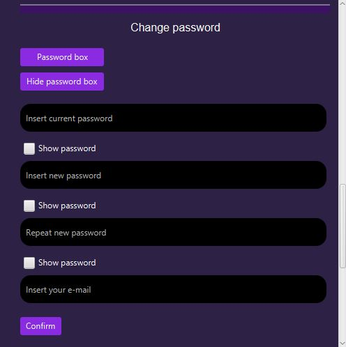

# SCHOOL ELECTRONIC DIARY PROJECT

This was my college project that contains most of the elements which are a part of curriculum for Object-oriented programming class. It contains basic concepts of object-oriented programming in Java. Apart from that, this project implements MySQL database for data storage and GUI using JavaFX. When it came to UI design, having no restrictions enabled me to show my creative side.

When starting this program, log-in dialog pops up.

There are two types of e-diary users: professors and students. Depending on the person logging in, different windows pop-up with different possibilities. 

In some use-cases, such as changing password or adding a new user, an e-mail notification gets sent to the user.

    NOTE: Gmail doesn't allow sending e-mail from code anymore so this feature doesn't work.

## Database scheme

To create database for this project, use this file: <a href="ors1_opp_2021_2022.sql">ors1_opp_2021_2022</a>

## Screenshots

